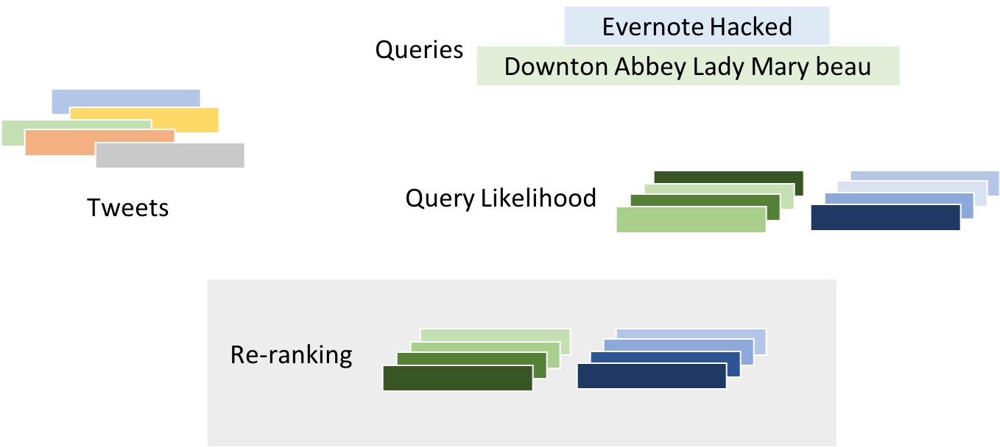
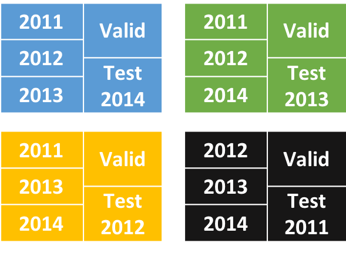

# Tweets Relevance Ranking with Representation Learning

## Task

Basically the task is relevance matching task. More specifically is to use neural model to rerank tweets based on the collection retrieved by statistical model such as Query Likelihood.




## Dataset

Dataset for this task is from [TREC Microblog Tracks](https://trec.nist.gov/data/microblog.html) from 2011 to 2014.
In each year, there will be a set of queries (or called topics) provided by NIST for evaluation. For example,

> Evernote Hacked

Using the Query Likilihood Baseline, we could retrieve up to the top 1000 tweets. Example tweets are shown as follows.

>addicted to Evernote @url <br/>
>Your Evernote password has been hacked

There are judgements for a pool of tweets. For example, ***addicted to Evernote @url*** is not relevant and ***Your Evernote password has been hacked*** is relevant to the query.

We run four-fold cross-validation test split by year's data (i.e., train on three year's data, test on one year's data), and we sample 10 queries from each year in the training sets (in total 30 queries) as the validation set. 



- Statistics of dataset is shown as follows.

|Year|2011|2012|2013|2014|
|:--:|:--:|:--:|:--:|:--:|
|#queries|49|60|60|55|
|#tweets|39,780|49,879|46,192|41,579|
|#relevant|1,940|4,298|3,405|6,812|
|%relevant|4.87|8.62|7.37|16.38|

- Sampled validation query ID set for each fold

|2011|2012|2013|2014|
|:--:|:--:|:--:|:--:|
|3|53|123|185|
|8|58|130|190|
|11|64|138|203|
|12|74|140|204|
|13|86|143|206|
|17|93|146|207|
|19|97|152|209|
|34|100|158|214|
|40|102|167|217|
|41|107|168|221|

You could download dataset by running

```
wget http://ocp59jkku.bkt.clouddn.com/twitter_relevance_matching/data.zip
unzip data.zip
```

For fields of dataset (such as train123.comb) is shown as follows (Feature is not discussed in paper)
```
Query ID, Sequence ID, Query, Tweet, Label, TimeStamp, Feature
```

## Software

The implementation is based on ***PyTorch 0.4***, ***torchtext0.2.3***, ***tensorflow***(for tensorboard) and ***python 3.6***. If you are new to these libraries, we recommend you to follow the instruction below to install the dependencies. 

### Conda 
We use conda as your python environment manager, which we highly recommend. To install conda, please visit [here](https://www.anaconda.com/download/) to install the Python3.6 version in your machine.

For example, we use linux 64bit OS so we download regarding version, and isntall. 
```
wget https://repo.anaconda.com/archive/Anaconda3-5.1.0-Linux-x86_64.sh
bash Anaconda3-5.1.0-Linux-x86_64.sh
```

### Environment
We recommend you to use *environment* to manage your library dependencies. 
To create an environment and activate it:
```
conda create --name deeplearning
source activate deeplearning
```
Now, you are in your created environment calld *deeplearning*.
To leave this environment, just simply use
```
source deactivate
```

### PyTorch, torchtext and TensorFlow
Here we use the PyTorch 0.4.0 version and torchtext 0.2.3 
```
conda install torchvision -c pytorch
conda install -c anaconda cython
conda install -c anaconda scipy 
pip install torchtext
```
We utilize the *TensorFlow* for visualization. Here in our machine, we use cuda8.0, so we need to install the package with specific version.
```
pip install tensorflow-gpu==1.4.1
```
If you are using higher version of cuda, you could use 
```
pip install --ignore-installed --upgrade tfBinaryURL
```
for the URL, please visit [here](https://www.tensorflow.org/install/install_linux?hl=en#the_url_of_the_tensorflow_python_package) to get the one regarding your machine.

## Quick Start

If you want to directly replicate the model, you could directly run 

```
python trainer.py --train_dataset 123 --model_type attn --gating_source ave --gpu 0 --thread 2 
```

With this command, you will start to train 10 single model with different reandom seed. 
- **--train_dataset** means the dataset you are going to use to train. For example, **123** means you are training to *2011, 2012 and 2013* and futher testing on *2014*. Other options are **124, 134, 234** which have similar meanings.
- **--model_type** means the model you use. There are three options: **attn**(PAtt), **qac**(QAtt) and **baseline**(BiCNN).
- **--gating_source** means the aggregation method you use when you are in mode such as **PAtt** or **QAtt**. Possible options are **embed** and **ave**. If you are running in the **baseline** mode, please do not forget put **none** on this option.
- **--gpu** means gpu id you are used for training
- **--thread** means the number of models you are training in parallel. This depends on the memory of GPU.

After the training, you could test the model.

```
python tester.py --train_dataset 123 --model_type attn --gating_source ave --gpu 1
```

This command line basically will run through all the trained models and get results.
Noted that you need to put **none** for **--gating_source** option when you are runing the baseline model.

After this, you need to run 

```
python ensemble.py --train_dataset 123 --log_dir attn_ave_123_log
```

to get final results.

The **--log_dir** is subject to your training and testing. The name of directory is composed by **model_type**, **gating_source** and **trainig_dataset**. You need to compose this by yourselves.

To get interplolation results, you could run

```
mkdir interpolation
python interpolation.py --train_dataset 123 --baseline_eval baseline/run.microblog2014.QL.txt --model_eval attn_ave_123_log/pred.test.ensemble --baseline_data data/run.microblog123.QL.valid.txt --model_data attn_ave_123_log/pred.valid.ensemble --model_use_exp > interpolation/train123.log
```
You could get results from **interpolation/train123.log**

That's it.


